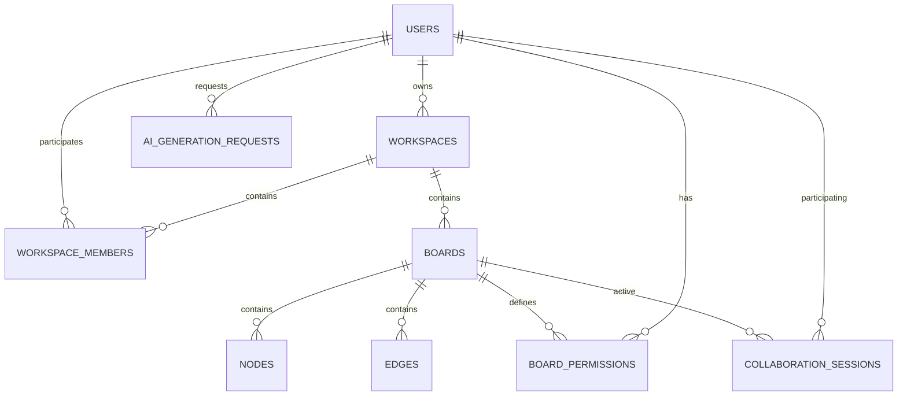

# Database Documentation

## Overview
FlowSpace utilizes **PostgreSQL 17** as its primary relational engine. To ensure high-performance sorting and efficient indexing of time-series-like data, all primary keys use **UUIDv7**.

## Naming Conventions
- **Tables**: `snake_case`, plural (e.g., `workspaces`).
- **Columns**: `snake_case`, singular (e.g., `display_name`).
- **Primary Keys**: Always named `id`.
- **Foreign Keys**: `singular_table_name_id` (e.g., `workspace_id`).
- **Indexes**: `idx_{table}_{columns}`.
- **Constraints**: 
  - PK: `pk_{table}`
  - FK: `fk_{table}_{reference_table}`
  - Unique: `uq_{table}_{columns}`

---

## Entity Relationship Diagram (ERD)

---

## Tables

### 1. users
| Column | Type | Constraints | Description |
| :--- | :--- | :--- | :--- |
| id | uuid | PK | UUIDv7 |
| email | varchar(255) | UQ, NOT NULL | Primary identifier |
| display_name | varchar(100) | NOT NULL | Profile name |
| avatar_url | text | NULL | URL to MinIO/CDN |
| created_at | timestamptz | DEFAULT now() | |
| updated_at | timestamptz | DEFAULT now() | |

### 2. workspaces
| Column | Type | Constraints | Description |
| :--- | :--- | :--- | :--- |
| id | uuid | PK | UUIDv7 |
| name | varchar(200) | NOT NULL | |
| owner_id | uuid | FK -> users(id) | |
| is_deleted | boolean | DEFAULT false | Soft delete |
| created_at | timestamptz | DEFAULT now() | |

### 3. workspace_members
| Column | Type | Constraints | Description |
| :--- | :--- | :--- | :--- |
| workspace_id | uuid | FK, PK | |
| user_id | uuid | FK, PK | |
| joined_at | timestamptz | DEFAULT now() | |

### 4. boards
| Column | Type | Constraints | Description |
| :--- | :--- | :--- | :--- |
| id | uuid | PK | UUIDv7 |
| workspace_id | uuid | FK -> workspaces(id) | |
| name | varchar(200) | NOT NULL | |
| type | varchar(50) | NOT NULL | Whiteboard, Flowchart, etc. |
| created_at | timestamptz | DEFAULT now() | |
| updated_at | timestamptz | DEFAULT now() | |

### 5. nodes
| Column | Type | Constraints | Description |
| :--- | :--- | :--- | :--- |
| id | uuid | PK | UUIDv7 |
| board_id | uuid | FK -> boards(id) | |
| type | varchar(50) | NOT NULL | Rectangle, Circle, etc. |
| x | float8 | NOT NULL | Position X |
| y | float8 | NOT NULL | Position Y |
| width | float8 | NULL | |
| height | float8 | NULL | |
| metadata | jsonb | DEFAULT '{}' | Flexible attributes |
| version | int4 | DEFAULT 1 | For concurrency/sync |

### 6. edges
| Column | Type | Constraints | Description |
| :--- | :--- | :--- | :--- |
| id | uuid | PK | UUIDv7 |
| board_id | uuid | FK -> boards(id) | |
| source_node_id | uuid | FK -> nodes(id) | |
| target_node_id | uuid | FK -> nodes(id) | |
| metadata | jsonb | DEFAULT '{}' | |

### 7. board_permissions
| Column | Type | Constraints | Description |
| :--- | :--- | :--- | :--- |
| id | uuid | PK | |
| board_id | uuid | FK -> boards(id) | |
| user_id | uuid | FK -> users(id) | |
| role | varchar(20) | NOT NULL | Owner, Editor, Viewer |

### 8. collaboration_sessions
| Column | Type | Constraints | Description |
| :--- | :--- | :--- | :--- |
| id | uuid | PK | |
| board_id | uuid | FK -> boards(id) | |
| user_id | uuid | FK -> users(id) | |
| connected_at | timestamptz | DEFAULT now() | |

### 9. ai_generation_requests
| Column | Type | Constraints | Description |
| :--- | :--- | :--- | :--- |
| id | uuid | PK | UUIDv7 |
| user_id | uuid | FK -> users(id) | |
| prompt | text | NOT NULL | |
| output | jsonb | NULL | Generated nodes/edges |
| status | varchar(20) | DEFAULT 'pending' | |
| created_at | timestamptz | DEFAULT now() | |

---

## Indexes

### Performance Optimization
- `idx_workspaces_owner_id`: Fast lookup of workspaces for a user.
- `idx_boards_workspace_id`: Efficient listing of boards in a workspace.
- `idx_nodes_board_id`: Fast retrieval of all nodes for a board canvas.
- `idx_edges_board_id`: Fast retrieval of all edges for a board canvas.
- `idx_board_permissions_user`: Quick check of which boards a user can access.

### Search & Filtering
- `idx_users_email_hash`: Hash index for ultra-fast login lookups.
- `idx_nodes_metadata_gin`: GIN index on `metadata` JSONB for deep attribute searching.

---

## Constraints
- **Foreign Keys**: All FKs use `ON DELETE CASCADE` for canvas elements (Nodes/Edges) when a board is deleted.
- **Role Validation**: `CHECK (role IN ('Owner', 'Editor', 'Viewer'))` in `board_permissions`.
- **Type Validation**: `CHECK (type IN ('Whiteboard', 'Flowchart', 'Mindmap', 'Wireframe'))` in `boards`.

---

## UUIDv7 Implementation
While PostgreSQL 17 handles the `uuid` type natively, UUIDv7 values should be generated by the **Application Layer** (C# or TypeScript) before insertion to ensure they are monotonically increasing. This optimizes B-Tree index insertion performance and provides natural time-based sorting.
